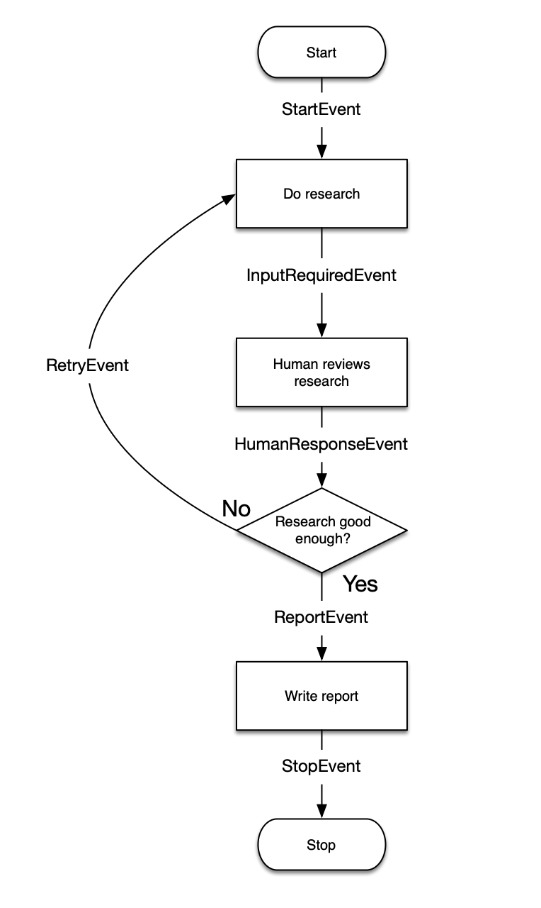

# Human in the Loop Workflow demo

This is a full-stack demonstration of how to build a LlamaIndex workflow that uses a human in the loop.

The workflow is a dummy flow that simulates a report-writing agent: you give it a topic, it does research for you, and then presents that research. If you think the research is sufficient, you can approve it and the LLM will write a report based on the research. If you think the research is insufficient, you can reject it and the LLM will do more research.

# Frontend

This is a starter Next.js app. Its primary function is to open a websocket connection to the backend, and print out the events that come back. It handles 3 types of events:

1. `progress` events, which the workflow emits to report on its progress. It simply prints these out.

2. `input_required` events, which the workflow emits when it needs human input. It prints out the payload, and generates two buttons that the human can use to accept or reject the research.

3. `final_result` events, which the workflow emits when it is complete. It prints out the final result.

All the logic is handled by the backend, and the frontend is just a display.

# Backend

This is a FastAPI app. It has a websocket endpoint that the frontend connects to. It uses the `HITLWorkflow` class to run the workflow.

## FastAPI

This does a few simple things:

1. Accepts a websocket connection from the frontend
2. Instantiates the workflow with the first message it gets from the frontend as the query.
3. Streams events from the workflow back to the frontend; these are the three types of events described above.
    * If it gets an `InputRequiredEvent`, it expects the next message from the frontend to be the approval or rejection of the research.
    * Once it gets the approval or rejection, it sends that back to the workflow as a `HumanResponseEvent`.
    * If it gets a `ProgressEvent`, it sends that back to the frontend.
4. Once the workflow is complete, it sends the final result back to the frontend.
5. Handles websocket cleanup once the workflow is complete.

## Workflow

Both the frontend and the fastAPI are primarily message-passing, and the real work happens (or would happen, if it weren't a dummy) in the workflow itself, which follows the pattern in the diagram at the top of this page.

